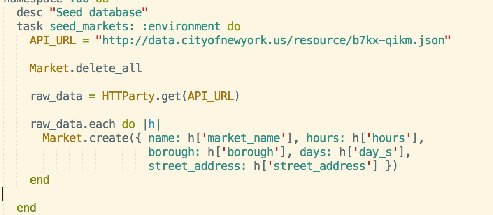
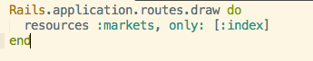
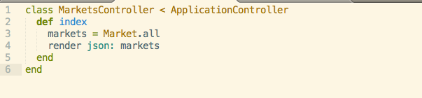
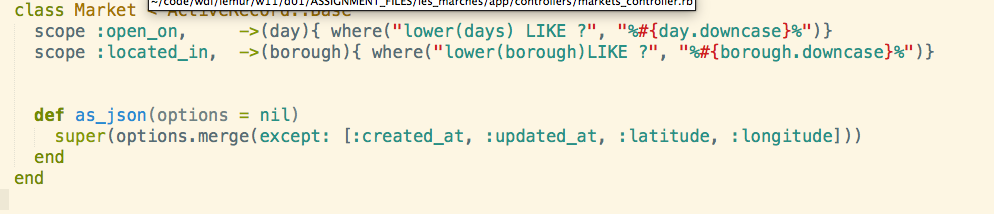
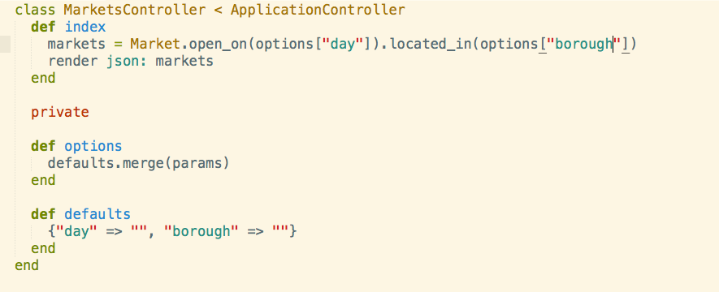
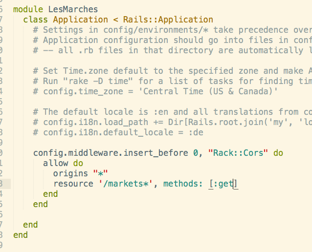
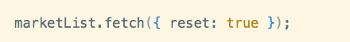
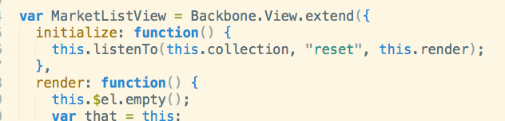
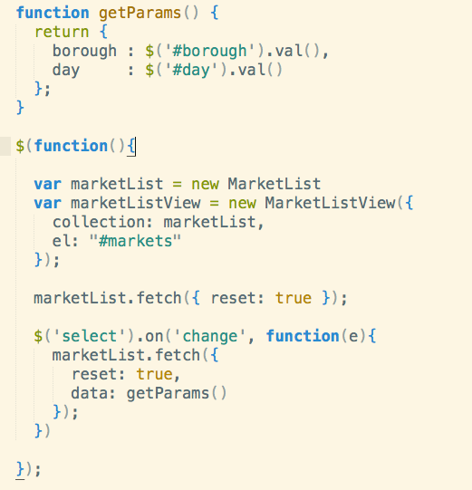

# Server
## Learning objectives
* I can use the `rails-api` gem to generate an api * I can control json serialization through overriding `ActiveRecord::Base`'s `as_json` method
* I can implement `ActiveRecord` scopes
* I can implement `CORS` using `rack-cors` gem.


## 1. Install 'rails-api' gem
```bash
gem install rails-api
```

- ***Note:*** This code has been generated for you so you can disregard this step.


## 2. Generate rails api using gem
```bash
rails-api new farmers_markets
```

- ***Note:*** This code has been generated for you so you can disregard this step.

## 3. Create model
```bash
rails g model Market name:string hours:string borough:string days:string street_address:string latitude:float longitude:float
```
- ***Note:*** This code has been generated for you so you can disregard this step.

## 4. Create DB
```bash
rake db:create && rake db:migrate
```

## 5. Seed DB
1.  Generate rake task
```
rails g task db seed_markets
```
2.  Write rake task in "lib/tasks/db.rake"

3.  Run rake task
```bash
  bin/rake db:seed_markets
```
***Note:*** Be sure to include 'httparty' in your gemfile and require it in `db.rake`

## 6. Routing and Controller

1.  Set up resources for `markets`.  We will only need an index action.

2. Set up controller



Now we have a basic api.  Let's visit `localhost:3000/markets`


## 7.  Improving our API.  

#### What if we don't want our rendered json to include `created_at` and `updated_at` timestamps?

Let's have a look at [as_json](http://api.rubyonrails.org/classes/ActiveModel/Serializers/JSON.html#method-i-as_json).

#### What if we want to filter our data by certain attributes?

Let's have a look at [active record scopes](http://guides.rubyonrails.org/active_record_querying.html#scopes)






## 8. Cross Origin Resource Sharing (CORS)

What if we want to hit up our API?  Enter [CORS](http://enable-cors.org/)

We will implement cors using the [rack-cors](https://github.com/cyu/rack-cors) gem. We can enable CORS by white listing all request origins and specifying what constitutes an allowed resource request.
In "config/application.rb"


Voila!


# Client

##Learning Objectives
* I can implement underscore templating
* I can trigger a `reset` event on a collection after fetch
* I can set a `data` attribute on the object literal passed to `collection.fetch()`

We make a basic "to-do" style application using Backbone components.  

## `Market` Model
* There isn't much to see here.

var *Object* = *Object*.Model.extend({});


## `MarketList` Collection
* Notice the url's domain is different from the one that is serving our application.

var MarketList = Backbone.Collection.extend({
  model: Market,
  url: "https://enigmatic-depths-9871.herokuapp.com/markets"
});

## `MarketView` View
* We will use underscore's native templating language.  (The template has already been provided for you)
* When we call the `template` function, we need to pass in the object returned by calling `toJSON()` on the view's model.  

var MarketView = Backbone.View.extend({
  tagName: 'li',
  template: _.template($("#market-template").html()),
  events: {
    "click" : "toggleDetails"
  },
  render: function () {
    this.$el.html( this.template({ market: this.model.toJSON()}));
    return this;
  },
  toggleDetails: function() {
  }
})


## `MarketListView` View

var MarketListView = Backbone.View.extend({
  initialize: function() {
    this.listenTo( this.collection, 'add', this.render );
  },
  render: function() {
    this.$el.empty();
    var that = this;
    this.collection.each(function(market) {
      var view = new MarketView({model: market});
      that.$el.append(view.render().$el);
    });
  }
})

* How long does it take to render when we bind the render function to a `collection:add` or `collection:change` event? (Perhaps there is an optimization to be made here)


## How can we make this application better?

#### It would be nice to render only after the collection is done updating.  This is possible using `{ reset: true }`






Woah, that's a lot faster!

#### It would be nice to filter our results  

We can do this be fetching our collection when the select boxes are manipulated.  Notably, we include a data attribute in the object passed to `collection.fetch`.




***Note:*** We could do this without making a request to the server.  Take a look at [collection.where](http://backbonejs.org/#Collection-where)
